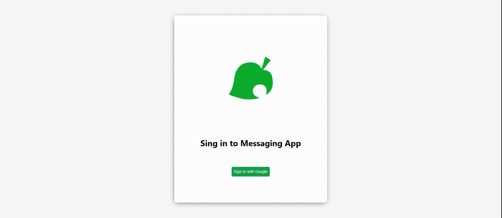

# Chat with Nicolas

Hello everyone! Chat with Nicolas is a real-chat application where you can login and chat with everyone in the group!

**Link to project:** https://messaging-app-mern-a5520.web.app/

## How It's Made:

**Tech used:**

### Frontend

HTML, CSS, JavaScript, React.js, MUI, Pusher.js, Axios and Firebase

### Backend

Node.js, Express.js, Pusher, Mongoose, Cors

I started this project with the idea that I wanted to create something that would have a dynamic, realtime DB and that would allow a certain level of communication.

## Optimizations

Once I have more time I'd definitely want to re-code the whole thing with TS. I am very fond of the language and I am very aware of its potential. Site is also not fully responsive, because I engineered primarly for the desktop users but it would also be great to take care of that.

## Lessons Learned:

It was my first time using Pusher and I wasn't aware of how much time would it take me to set-up. Another difficult part was debugging firebase deployments and it took me several hours but I've successfully went through that.

## Examples:

Take a look at these couple examples that I have in my own portfolio:

**BoardGameEnthusiast:** https://github.com/mikolaszko/BoardGameEnthusiast-e-commerce

**Twitter:** https://github.com/mikolaszko/Twitter-clone-2.0

**Hulu:** https://github.com/mikolaszko/hulu-2.0
